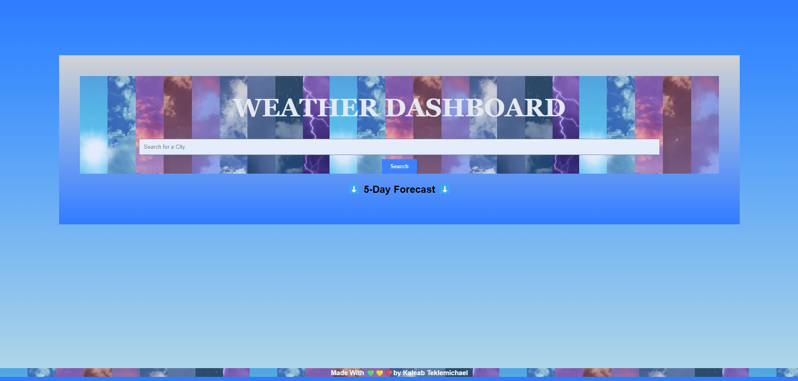

# Weather Dashboard

This is a weather forcast dashboard that displays the 5day forcast and uses the OpenWeather Api. This weather dashboard will run in the browser and it features a dynamically updated HTML and CSS with the weather data. It also saves you're serached items to localStorage and is a button that you can use to search again.
Follow this link to access this Weather Dashboard Website - https://baelak.github.io/KT-M6-weather-Dashboard/

Enjoy

💚💛❤️

Kaleab Teklemichael